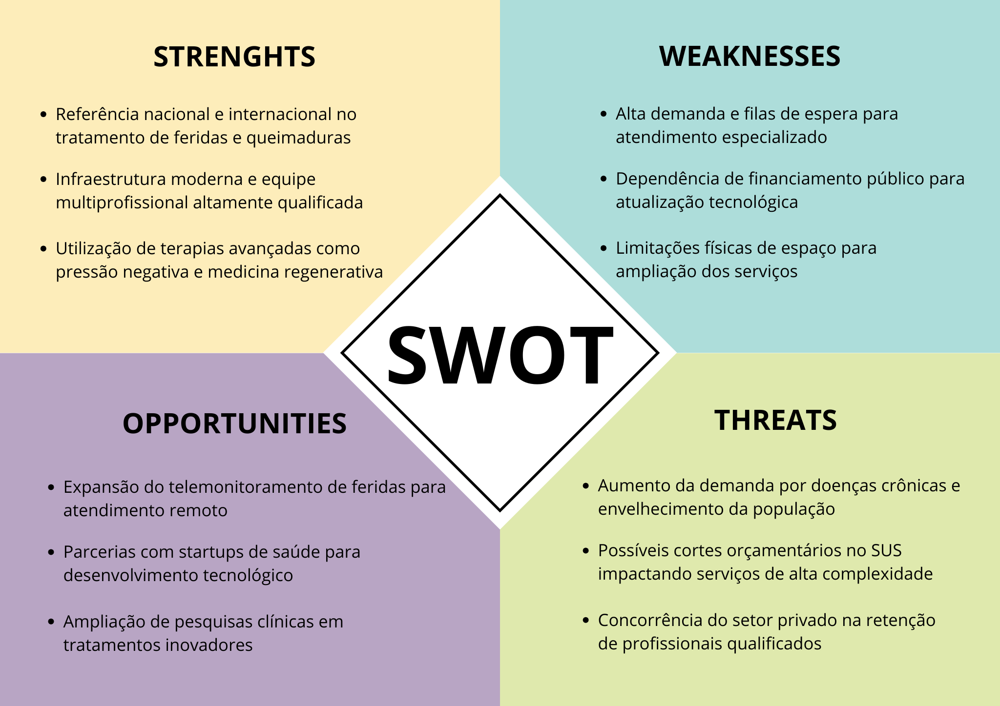
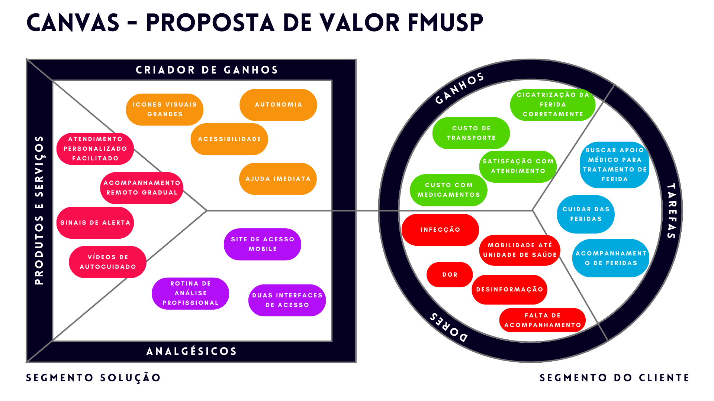
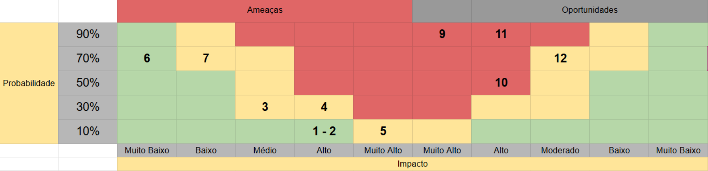
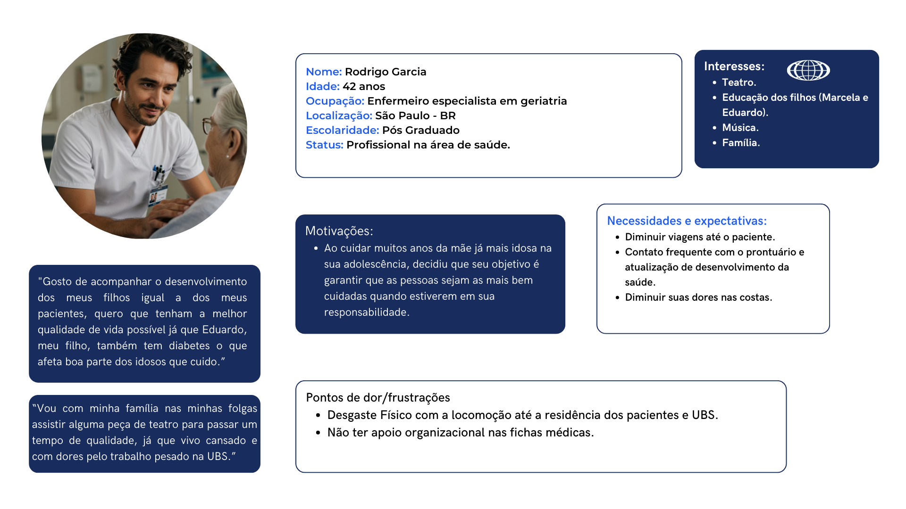

# WAD - Web Application Document - Módulo 2 - Inteli

**_Os trechos em itálico servem apenas como guia para o preenchimento da seção. Por esse motivo, não devem fazer parte da documentação final_**

## Nome do Grupo

#### Nomes dos integrantes do grupo

## Sumário

[1. Introdução](#c1)

[2. Visão Geral da Aplicação Web](#c2)

[3. Projeto Técnico da Aplicação Web](#c3)

[4. Desenvolvimento da Aplicação Web](#c4)

[5. Testes da Aplicação Web](#c5)

[6. Estudo de Mercado e Plano de Marketing](#c6)

[7. Conclusões e trabalhos futuros](#c7)

[8. Referências](c#8)

[Anexos](#c9)

 

# 1. Introdução (sprints 1 a 5)

Na seção 1, serão apresentadas as principais concepções envolvendo o projeto e o desenvolvimento detalhado da nossa solução, incluindo aprofundamento na problemática apresentada pelo parceiro de negócios, a Faculdade de Medicina da USP, juntamente aos requisitos considerados para elaboração da aplicação web proposta. 

Nesse sentido, observa-se o crescente número de pessoas portadoras de feridas, sendo elas, em sua maioria, acometidas por dificuldades de mobilidade, idade avançada e comorbidades associadas, fatores que impõem significativas barreiras ao acesso a cuidados especializados e à adesão a tratamentos contínuos. Essa situação resulta em tratamento inadequado das lesões e em uma redução da qualidade de vida dessa parcela populacional já fragilizada pela existência de feridas e pelas dificuldades em obter o suporte necessário.
Em vista dessa problemática de acesso e acompanhamento inadequado, a aplicação web SKAMA tem como objetivo estabelecer uma comunicação eficiente e garantir o acesso facilitado entre UBSs (Unidades Básicas de Saúde) e pacientes portadores de feridas. A solução visa otimizar o serviço de atendimento das instituições de saúde, permitindo o acompanhamento remoto do quadro clínico do paciente e possibilitando intervenções presenciais mais direcionadas quando necessário, não no objetivo de substitui-las, mas contribuindo com coleta de informações mais essencias. Essas medidas serão viabilizadas por um sistema de envio e recebimento de fotos e por um formulário detalhado sobre a situação da ferida. Além disso, a solução apresenta vídeos educativos que auxiliam na autonomia do paciente em relação aos cuidados necessários para a ferida, além de possibilitar atendimento prioritário em casos de urgência. 
Dessa forma, o aplicativo busca aumentar significativamente a adesão ao tratamento por parte dos pacientes, contribuindo para uma recuperação mais eficaz e para a melhora da sua qualidade de vida.

# 2. Visão Geral da Aplicação Web (sprint 1)

## 2.1. Escopo do Projeto (sprints 1 e 4)

### 2.1.1. Modelo de 5 Forças de Porter (sprint 1)

As Cinco Forças de Porter são um modelo de análise estratégica, proposto pelo professor da Harvard Business School Michael Porter em 1979, que tem como finalidade compreender a intensidade da competição em um determinado setor de mercado. Nesse sentido, o framework é utilizado para avaliar os principais concorrentes, outros atores relevantes (como fornecedores e compradores) e as forças competitivas que moldam as relações dentro desse mercado, auxiliando na identificação da atratividade do setor e na formulação de estratégias competitivas eficazes. As 5 forças que compõem esse modelo são: rivalidade entre concorrentes, rivalidade entre produtos substitutos, ameaça de entrada de novos concorrentes, poder de negociação dos clientes e poder de negociação dos fornecedores (Casarotto, 2020).
 

#### *1ª Força: Rivalidade entre concorrentes*
A primeira 1ª Força de Porter refere-se à rivalidade entre concorrentes, que tem como propósito avaliar o nível de competição existente entre players do mercado, a fim de examinar os desafios a serem superados para conquistar market share (Scherma, 2024).

Sob essa perspectiva, o setor de microcirurgias, cirurgia plástica e tratamento de feridas da Faculdade de Medicina da USP oferece serviços de alta complexidade e qualidade, abrangendo a especialização cirúrgica para o tratamento de lesões complexas, feridas de difícil cicatrização e deformidades mas que, apesar de seu renome e expansão no mercado, apresenta alguns concorrentes que se destacam. Entretanto, vale ressaltar que há uma grande diferenciação na FMUSP, tendo em vista que é uma instituição acadêmica e, por isso, tem foco adicional em pesquisa e ensino.

Tendo isso em vista, pode-se mencionar como principais concorrentes instituições como o Hospital Israelita Albert Einstein (Hospital Israelita Albert Einstein, 2024) e o Hospital Sírio-Libanês (Hospital Sírio-Libanês), que, embora tenham um viés mais voltado à assistência privada e de alto padrão, também oferecem serviços de cirurgia plástica e microcirurgia com excelência reconhecida nacional e internacionalmente.

Ademais, a competitividade está presente também no setor público, no qual hospitais como o Hospital de Clínicas da UNICAMP (Hospital de Clínicas da Unicamp, 2025) e o Hospital de Base de São José do Rio Preto também atuam com elevado grau de especialização na mesma área do HCFMUSP, juntamente ao Hospital Universitário Pedro Ernesto da UERJ, que apresenta posição de destaque em relação a formação de médicos e produção científica no Rio de Janeiro (UERJ, 2025).

A rivalidade no setor de microcirurgia e cirurgia plástica é, portanto, acirrada, e as instituições competem não apenas em termos de qualidade e complexidade dos serviços prestados, mas também em inovação, formação acadêmica e pesquisa. Embora o HCFMUSP tenha um diferencial em ser uma instituição acadêmica de grande porte, sendo o maior complexo hospitalar da América Latina, sua concorrência exige um contínuo aprimoramento dos seus processos, para garantir sua posição de destaque diante de players altamente competitivos, tanto do setor privado quanto público.
 

#### *2ª Força: Ameaça de produtos substitutos*
A Segunda Força de Porter, como mencionado anteriormente, refere-se à ameaça de produtos entrantes. Nesse sentido, é fundamental avaliar quais produtos ou serviços oferecem soluções iguais ou semelhantes às suas, ou que promovem a mesma solução de uma maneira distinta.

Inicialmente, convém considerar que o parceiro de projetos FMUSP atua em diversas áreas. Para esta análise específica, focamos na área de Cirurgia Plástica, dentro do setor de Microcirurgia e, mais precisamente, no departamento de Feridas. Para realizar uma análise comparativa eficaz, foi imprescindível compreender os serviços existentes e a forma como são executados nesse contexto, para então identificar a segunda força de Porter.

Sob essa perspectiva, é necessário salientar a existência de uma cartilha oficial, denominada “Manual de Padronização de Curativos”, que oferece diretrizes sobre os tipos de feridas, bem como as considerações para o curativo ideal. Essa escolha envolve diversas camadas de análise, abrangendo a classificação das feridas, o processo de cicatrização e, finalmente, a avaliação das feridas e as etapas de tratamento (Secretaria Municipal de Saúde, 2022). Como o próprio nome sugere, há uma padronização de cuidados e curativos para as feridas, o que minimiza a ameaça iminente para o parceiro, uma vez que existe um padrão estabelecido para ser seguido. Essa padronização transcende o âmbito do Estado de São Paulo, visto que outros documentos orientam os tratamentos e são publicados para facilitar o acesso ao conhecimento. Isso se deve à atuação do CFM (Conselho Federal de Medicina), que estabelece normas e práticas alinhadas à ética médica; do Ministério da Saúde, com políticas e diretrizes para o SUS (Sistema Único de Saúde), a exemplo do PCDT, um documento de “Linhas de Cuidado e os Protocolos Clínicos e Diretrizes Terapêuticas”; e da ANVISA (Agência Nacional de Vigilância Sanitária), responsável por padronizar e regulamentar os cuidados com a saúde. A atuação conjunta desses órgãos e segmentos visa garantir a qualidade e o tratamento ideal na área da saúde, proporcionando um escopo e uma linha de cuidados a serem seguidos, que acompanham os estudos e avanços da medicina.

Em um repositório vinculado à USP, encontra-se o artigo denominado “Sistematização de curativos para o tratamento clínico das feridas”, que informa que os serviços oferecidos para o tratamento de feridas utilizam curativos não aderentes, curativos não aderentes com silicone, filme transparente, espuma polimérica com ou sem prata, hidrogel e alginato de cálcio, carvão ativado com prata e malha com prata, que representam os métodos mais comuns. Adicionalmente, existem métodos cirúrgicos para casos específicos (Smaniotto et al., 2012). Esses métodos são complementados por outros procedimentos, especialmente no tratamento de lesões complexas, como úlceras por pressão, úlceras venosas e pé diabético. Um exemplo notável é a terapia por pressão negativa (vácuo), que oferece o benefício de uma formação mais precoce de tecido de granulação, além de facilitar a enxertia e promover uma recuperação mais rápida (Teixeira et al., 2010).

Diante do exposto, a existência de um padrão de tratamento estabelecido atenua significativamente a ameaça de novos produtos para o parceiro. Isso se deve ao fato de que o desenvolvimento de novos tratamentos exige um rigoroso processo de pesquisa, testes e aprovações por conselhos e pela comunidade científica, que validam a eficácia de novos métodos e curativos antes que possam ser recomendados como práticas seguras para o tratamento de feridas.

Em suma, embora o cenário atual demonstre uma baixa ameaça de novos entrantes devido à padronização e ao rigor científico exigido na área de tratamento de feridas, é crucial reconhecer o dinamismo da ciência médica. Pesquisas promissoras em áreas como a engenharia de tecidos, a aplicação de inteligência artificial na análise de feridas e o uso de biomateriais inovadores, como a pele de tilápia, sinalizam um horizonte de possíveis transformações nos métodos de tratamento. Contudo, dado o estágio inicial dessas pesquisas e a necessidade de validação clínica robusta, a FMUSP mantém-se alinhada às metodologias de tratamento consagradas, garantindo a qualidade e a segurança dos cuidados prestados aos pacientes.

#### *3ª Força: Ameaça de novos entrantes*
A ameaça de novas entrantes na área de atendimento em cirurgia plástica, com ênfase na curadoria de feridas e queimaduras, é relativamente baixa quando se considera o Hospital das Clínicas da Faculdade de Medicina da Universidade de São Paulo (FMUSP). A barreira de entrada elevada decorre de diversos fatores, como os rigorosos critérios de acreditação exigidos para cursos de medicina e a necessidade de uma infraestrutura hospitalar altamente especializada para a realização dessas cirurgias. No caso específico do setor de cirurgia plástica do Hospital da FMUSP, a existência de centros avançados de tratamento de feridas complexas e queimaduras, aliada à expertise multiprofissional, representa um diferencial difícil de ser replicado por novas instituições (Michael, 2019). Além disso, a reputação da FMUSP, consolidada pela excelência acadêmica e pela produção científica de alto impacto, funciona como uma vantagem competitiva significativa, tornando ainda mais desafiadora a entrada de novos concorrentes nesse segmento altamente especializado.

#### *4ª Força: Poder de negociação dos clientes* 
Analisando a ameaça de novos entrantes no mercado para o setor de cirurgia plástica do Hospital das Clínicias (HC) da Universidade de São Paulo(USP), apesar de usar enxertos de pele combinados com matrizes dérmicas em casos selecionados e a terapia a vácuo em larga escala, que indicam pesquisa e inovação (USP, 2019), há algumas possibilidades para entrarem novos produtos, como no caso dos produtos de matriz dérmica NEVELIA® e colas biológicas (TISSUEAID™) (SYMATESE, 2025). Por exemplo, se alguma empresa investir também nisso e trouxer essa tecnologia ao Brasil de forma barata, pode-se ter esse tratamento que, mesmo pago, pode se mostrar mais eficaz para desaguar o sistema único de sáude (CÂMARA MUNICIPAL DE BELO HORIZONTE, 2025).  Há também, no HC da USP a demora na indicação cirúrgica, ocorrendo tardiamente em muitas das vezes, prolongando o tempo de internação, custos e morbidade e, dessa forma, tratamentos privados podem ser escolhidos para um tratamento mais urgente, ou seja, não atendendo todos que usam desse produto (G1 RIBEIRÃO E FRANCA). Fora isso, há pouca integração entre especialidades, o que pode comprometer a continuidade e a qualidade do atendimento multidisciplinar (COLTRO et al., 2012).

#### *5ª Força: Poder de negociação dos fornecedores*
O poder de negociação dos fornecedores para a realização de cirurgias plásticas voltadas à curadoria de ferimentos no Hospital de Medicina da USP é altamente relevante. Isso ocorre devido à alta especialização e à diversidade de materiais requisitados para a realização dessas cirurgias, como peles artificiais, biomateriais, equipamentos de precisão, maquinários, entre outros (REVISTA SAÚDE, 2024). Além disso, esses produtos possuem poucos fabricantes, resultando em altos custos de aquisição e manutenção. Embora o prestígio acadêmico do hospital ofereça certa visibilidade aos fornecedores e possa minimizar parcialmente esse desequilíbrio, a baixa disponibilidade de substitutos e a impossibilidade de produção própria reforçam a posição de força dos fornecedores nesse contexto (ABRAIDI, 2025). Soma-se a isso o fato de que a troca de fornecedores exige readequação de protocolos e treinamentos médicos, o que pode acarretar custos consideráveis.

### 2.1.2. Análise SWOT da Instituição Parceira (sprint 1)

A matriz SWOT é uma ferramenta estratégica amplamente utilizada para a análise situacional de organizações, projetos ou setores específicos. O nome é um acrônimo em inglês para **Strengths** (Forças), **Weaknesses** (Fraquezas), **Opportunities** (Oportunidades) e **Threats** (Ameaças). Essa técnica permite visualizar, de forma estruturada, os fatores internos e externos que influenciam o desempenho de uma instituição, oferecendo subsídios para a tomada de decisões, o planejamento estratégico e a identificação de áreas prioritárias para intervenção (ASANA, 2024).

Sua utilidade reside na capacidade de promover uma compreensão mais ampla sobre o contexto em que uma organização está inserida, considerando tanto seus pontos fortes e vulnerabilidades internas quanto os elementos externos que podem favorecer ou ameaçar seus objetivos. Essa abordagem facilita a construção de estratégias que potencializam os recursos existentes e minimizam os riscos.

Neste projeto, a ferramenta será aplicada ao Setor de Cirurgia Plástica do Hospital das Clínicas da Faculdade de Medicina da Universidade de São Paulo (HC-FMUSP). Criado oficialmente em 1941, o setor consolidou-se como um dos mais importantes centros de ensino, pesquisa e assistência em cirurgia plástica da América Latina. Atua de forma integrada ao Sistema Único de Saúde (SUS), realizando atendimentos de alta complexidade e contribuindo significativamente para a formação de profissionais qualificados na área (FMUSP, 2024). A análise SWOT permitirá identificar os principais desafios e oportunidades que impactam o setor, especialmente no que se refere ao tratamento de feridas complexas e queimaduras, foco deste projeto.

   Imagem 1: Análise SWOT 
    
   Representação da Análise SWOT da Instituição Parceira
 

## Strengths (Forças)

O Setor de Feridas e Queimaduras do Hospital das Clínicas da FMUSP é considerado referência nacional e internacional devido à excelência no tratamento de casos complexos (HOSPITAL DAS CLÍNICAS DA FMUSP, 2024). Conta com infraestrutura de ponta, além de uma equipe multiprofissional altamente qualificada (FMUSP, 2024). A adoção de terapias avançadas, como curativos com pressão negativa e abordagens de medicina regenerativa, favorece uma recuperação mais rápida e segura para os pacientes (FMUSP, 2024).

## Weaknesses (Fraquezas)

Embora seja referência, o setor enfrenta problemas de alta demanda, gerando filas de espera para início de tratamento ((MOHR et al., 2021). A constante necessidade de atualizações tecnológicas depende do orçamento público, o que pode atrasar modernizações necessárias (FMUSP, 2024). Além disso, o espaço físico limitado dificulta a expansão da capacidade de atendimento (FMUSP, 2024).

## Opportunities (Oportunidades)

O avanço das tecnologias de telemonitoramento representa uma oportunidade para ampliar o alcance do atendimento, principalmente em locais remotos (CARBINATTO; AQUINO JUNIOR; BAGNATO, 2024). Parcerias com startups de tecnologia da saúde podem promover inovação no acompanhamento e tratamento de feridas (FMUSP, 2024). Há ainda potencial para ampliação das pesquisas clínicas, reforçando a posição do setor como centro de excelência em inovação (FMUSP, 2024).

## Threats (Ameaças)

O envelhecimento populacional e o aumento das doenças crônicas elevam a demanda por tratamentos complexos (MOHR et al., 2021). A possibilidade de cortes orçamentários no SUS ameaça a manutenção da qualidade dos serviços (CARBINATTO; AQUINO JUNIOR; BAGNATO, 2024). Além disso, a concorrência com hospitais privados para retenção de profissionais altamente capacitados pode dificultar a formação e manutenção de equipes de excelência (FMUSP, 2024).

### 2.1.3. Solução (sprints 1 a 5)

#### 1. Problema a ser resolvido

Uma parcela significativa da população brasileira convive com feridas crônicas, como úlceras por pressão, úlceras venosas e lesões associadas ao diabetes. Estima-se que mais de 2 milhões de brasileiros sofram com esse tipo de condição, sendo a maioria composta por idosos ou pessoas com comorbidades, o que contribui para dificuldades de locomoção e acesso recorrente aos serviços de saúde (ITL, 2025; HOSPITAL ALEMÃO OSWALDO CRUZ, 2023). Essa limitação faz com que muitos pacientes só procurem ajuda médica em estágios avançados da lesão, resultando em aumento da dor, risco de infecção, amputações, maior mortalidade e custos elevados de tratamento para o Sistema Único de Saúde (SUS) (SILVA et al., 2023; MOHR et al., 2023).

#### 2. Dados disponíveis

As feridas crônicas representam um desafio significativo para a saúde pública, afetando milhões de pessoas em todo o mundo. Estudos indicam que cerca de 20 milhões de indivíduos convivem com feridas crônicas globalmente, evidenciando a magnitude do problema (HOSPITAL ALEMÃO OSWALDO CRUZ, 2023).

No Brasil, a prevalência dessas lesões é particularmente preocupante entre a população idosa. Um estudo realizado com 339 idosos assistidos na atenção básica revelou prevalências de 5,0% para lesão por pressão, 3,2% para úlcera diabética e 2,9% para úlcera vasculogênica. Fatores como inatividade física e ausência de atividade laboral aumentaram significativamente o risco de desenvolvimento dessas feridas (SILVA et al., 2018).

Além das implicações físicas, as feridas crônicas impactam negativamente a qualidade de vida dos pacientes, afetando aspectos como mobilidade, sono e bem-estar emocional. A dor associada às lesões é frequentemente destacada como um dos principais fatores que comprometem a percepção de saúde e a capacidade funcional dos indivíduos (SANTOS et al., 2017).

Diante desse cenário, torna-se evidente a necessidade de estratégias eficazes para prevenção, monitoramento e tratamento das feridas crônicas, visando melhorar a qualidade de vida dos pacientes e reduzir os custos associados ao sistema de saúde.

#### 3. Solução proposta

Será desenvolvido um sistema web de telemonitoramento voltado para pacientes portadores de feridas crônicas, com o objetivo de melhorar o acompanhamento contínuo, promover o autocuidado e facilitar a atuação dos profissionais de saúde, especialmente no contexto da Atenção Primária.

O sistema contará com duas interfaces distintas, sendo uma voltada aos pacientes e outra aos profissionais de saúde das Unidades Básicas de Saúde (UBS) e agentes comunitários. A interface será desenvolvida segundo às necessidades e limitações dos seus usuários, especialmente considerando que muitos pacientes são idosos e podem ter pouca familiaridade com tecnologia.

#### Funcionalidades da interface do paciente:

- Envio periódico de fotos padronizadas da ferida, com uso de régua de medição integrada à imagem para facilitar o acompanhamento da evolução;
- Preenchimento de questionários de saúde simples e acessíveis, sobre dor, secreção, sinais de infecção, entre outros indicadores clínicos;
- Acesso a vídeos educativos personalizados conforme o tipo de ferida (úlceras por pressão, úlceras venosas ou pé diabético)
- Alertas e lembretes automáticos para envio de informações ou visualização de conteúdos importantes.
- Acesso a ficha médica preenchida pelo profissional de saúde, para que o paciente também possa acompanhar a sua evolução.

#### Funcionalidades da interface do profissional:

- Recebimento em tempo real das informações enviadas pelos pacientes sob sua responsabilidade;
- Painel com histórico evolutivo das feridas, com fotos comparativas e respostas dos questionários;
- Registro de condutas clínicas, envio de orientações personalizadas e acompanhamento remoto dos casos.

#### 4. Forma de utilização da solução

O sistema web de telemonitoramento será utilizado para conectar pacientes portadores de feridas crônicas às equipes das Unidades Básicas de Saúde (UBS). Inicialmente, agentes de saúde localizarão os pacientes nas comunidades e realizarão o cadastro no sistema. Os pacientes preencherão questionários sobre sua saúde geral e enviarão imagens da ferida utilizando uma régua como referência de tamanho. A comunicação ocorrerá de maneira periódica, com o envio de novas informações e fotos, conforme cronograma definido pelo profissional de saúde. Caso o paciente não envie atualizações dentro do prazo, a UBS será notificada para fazer o contato ativo. Além disso, o sistema oferecerá vídeos educativos adaptados ao tipo de ferida de cada paciente, promovendo maior conhecimento e adesão ao tratamento. Para pacientes com baixa alfabetização, haverá recursos de áudio para facilitar a comunicação.

#### 5. Benefícios esperados

A implementação do sistema web trará benefícios significativos tanto para os pacientes quanto para o Sistema Único de Saúde (SUS). Para os pacientes, o sistema facilitará o acompanhamento contínuo da condição, permitirá a detecção precoce de agravamentos e aumentará a adesão ao tratamento, promovendo melhora na qualidade de vida. Para os profissionais de saúde, o sistema otimizará o monitoramento dos casos, permitindo intervenções mais rápidas e baseadas em informações atualizadas. No âmbito do SUS, espera-se reduzir a necessidade de hospitalizações prolongadas e os custos associados ao tratamento de feridas crônicas. O projeto também busca promover a educação em saúde, autonomia aos pacientes no autocuidado e na gestão de sua condição.

Como referência de sucesso, destaca-se o projeto de telemonitoramento desenvolvido pela Universidade do Oeste Paulista (UNOESTE), que já realizou mais de 7 mil atendimentos à distância, demonstrando eficácia no cuidado remoto e redução na sobrecarga dos serviços presenciais. A iniciativa mostra que tecnologias de acompanhamento à distância, quando bem implementadas, podem ser escaladas e adaptadas a diferentes contextos de atenção à saúde (UNOESTE, 2023).

#### 6. Critério de sucesso e como será avaliado

- Critério principal: Taxa de adesão dos pacientes ao sistema (número de atualizações enviadas dentro do prazo combinado).
- Critérios complementares:
    - Redução do tamanho ou melhora clínica das feridas ao longo do acompanhamento.
    - Satisfação dos profissionais de saúde em relação ao uso do sistema, avaliada via questionários.
    - Feedback dos pacientes sobre a usabilidade e benefícios percebidos do sistema.
- Forma de avaliação:
    - Análise de métricas extraídas do sistema (frequência de envio de dados, tempo de resposta).
    - Avaliação qualitativa com entrevistas e questionários aplicados aos profissionais e pacientes participantes do projeto-piloto nas UBS.

### 2.1.4. Value Proposition Canvas (sprint 1): 
# Canvas Proposta de Valor

De acordo com o estudo “Business Model Canvas: aplicação do método em uma empresa” (SANTOS et al., 2020), CANVAS é uma ferramenta de negócios que auxilia as empresas ou empreendedores a encontrar a melhor forma de identificar a proposta de valor de uma empresa, aplicando a partir de segmentos como abordado no modelo a seguir.  
A partir desta explicação foi identificado que o público alvo é qualquer individuo que possa desenvolver feridas sejam de não emergências a emergenciais ao depender de seu caso clínico.  

   Imagem 1: CANVAS - Proposta de valor 
    
   Fonte: Til.app.ia, 2025 (Autoral)
 

---

## Segmento Cliente:

### Tarefas:

* Buscar apoio médico para tratamento médico para tratamento de ferida: Necessidade de opnião médica para resolução de problema se encaminhando para unidade pública ou particular de saúde mais próxima.
* Cuidar das feridas: Tratamento incorreto dos ferimentos pode gerar problemas sérios de saúde.
* Acompanhamento de feridas: Limpezas e cuidados com o local do ferimento solo em sua residência, sem acompanhamento adequado.

### Ganhos:

* Custo de transporte: Reduz o custo de transporte até a unidade de saúde.
* Custo de medicamentos: Com um cuidado adequado não é necessário tratar o ferimento em maior tempo que o necessário para a cicatrização/tratamento, evitando maiores gastos.
* Satisfação com o atendimento: Com um acompanhamento adequado e personalidade com o paciente, seu nível de satisfação aumenta.
* Cicatrização da ferida corretamente: Com cuidados de forma orientada e com materiais de qualidade,a minimização de danos à pele tem suas chances aumentadas.

### Dores:

* Infecção: Sem uma indicação ou acompanhamento adequado o paciente se encontra em cenário favorável a infecções e piora de quadro.
* Dor: Com o ferimento exposto, o público-alvo pode sentir de leves a fortes dores.
* Mobilidade até a unidade de saúde: O público ao se movimentar até a unidade de saúde para acompanhamento tem perca de tempo e financeira ao realizar o trajeto, gerando insatisfação.
* Desinformação: A falta de conhecimento gera a propensão de agravamento de quadro clínico, realizando portanto cuidados inadequados.
* Falta de acompanhamento: Após a primeira consulta médica, na maioria das vezes o paciente não volta para o monitoramento da lesão.

## Segmento Solução:

### Criador de Ganhos:

* Ícones Maiores: Ao identificar que parte do público é idoso é necessário design atrativo e visível para indivíduos com problemas visuais.
* Acessibilidade: Ao assegurar recursos no qual o indivíduo consiga acessar de maneira fácil e lúdica, garantimos a acessibilidade para o público.
* Ajuda Imediata: Junto ao acompanhamento do profissional de saúde é possível identificação de agravamento de quadro e encaminhamento imediato a emergência. Além disso, será disponibilizado ao usuário o botão de socorro no qual será encaminhado o número da ambulância em seu dispositivo móvel.
* Autonomia: Com os vídeos disponíveis o público tem a confiança em realizar os procedimentos com a recomendação de um médico.

### Analgésicos:

* Site de acesso mobile: Com o método mobile conseguimos expandir a utilização da aplicação web.
* Rotina de análise profissional: Com os registros obtidos e encaminhados ao um banco de dados o profissional consegue manter uma aproximação do paciente, o que leva uma alta na satisfação do atendimento e empatia no atendimento.
* Duas interfaces: Existindo uma relação interpessoal entre os profissionais e os pacientes identificamos a necessidade de duas interfaces diferentes que atendam as necessidades dessas duas figuras.

## Produtos e Serviços:

* Atendimento Personalizado: Ao gerar um cadastrado o atendimento realizado pelo profissional da saúde é individual a cada caso analisado e acompanhado.
* Sinais de alerta: Através de softwares de reconhecimento de imagem é possível verificar a partir da imagem gerada pelo dispositivo móvel do paciente colorações que apresentem risco ao quadro de saúde observado.
* Vídeos de autocuidado: Os vídeos disponibilizados pelo departamento de cirurgia plástica do hospital das clínicas em São Paulo garantem cuidados corretos e sinais de atenção, sendo disponibilizado a todo o momento para consulta do público-alvo dentro da plataforma.
* Acompanhamento remoto gradual: Será oferecido um acompanhamento dos hematomas através de imagens de maneira contínua até a resolução do quadro, no qual será acompanhado por um agente de saúde remotamente evitando desgaste físico dos pacientes.

### 2.1.5. Matriz de Riscos do Projeto (sprint 1)

| \#  | Ameaças | Impacto |
| --- | --- | --- |
| 1: | Queda de internet. | Impossibilidade de commits no código |
| 2: | Ferramentas off-line | Possíveis atrasos e não conclusão das tarefas |
| 3: | Mal planejamento das tarefas | Atraso na conclusão de tarefas e entrega nos prazos. |
| 4: | Entregas quinzenais ineficientes | Perda de confiança e perda de nota nos artefatos |
| 5: | Não conclusão do projeto | Queda na reputação com o parceiro, atraso relevante na entrega final e perda de nota do artefato. |
| 6: | Bugs no código | Atraso\impossibilidade de entrega dentro dos prazos |
| 7: | Conflito de visões para entrega do projeto | Desperdício de tempo em tarefas já designadas e discussão de ideias já definidas. |

| \#  | Oportunidades | Impacto |
| --- | --- | --- |
| 9: | Aprendizado. | O desenvolvimento e o aprendizado estão extremamente ligados pois à medida que aprendemos desenvolvemos e quando desenvolvemos aprendemos, sempre através de aulas, autoestudos, cursos, etc. |
| 10: | Engajamento. | Quando o grupo está engajado todos estão cumprindo com suas obrigações, realizando as tarefas e as entregando dentro dos prazos, isso faz com que o projeto ande e que todos possam evoluir juntos. |
| 11: | Aulas/Workshops para aprimoramento de habilidades técnicas. | Ter orientações extras sobre temas que são necessários para o desenvolvimento é uma ótima maneira para evoluir habilidades técnicas, podendo revisar conteúdos que possam ter passado e deixado dúvidas. |  
| 12: | Feedback positivo | Receber reconhecimento ou validação inesperada de profissionais ou especialistas pode impulsionar o projeto. |

## 2.2. Personas (sprint 1)

O modelo de Personas está enquadrado dentro da estratégia que satisfaz um senso de empatia no usuário e agrega valor ao produto consumido (Kuniavsky et al., 2012), o que torna a experiência do usuário o ponto central do modelo.

De acordo com a pesquisa “A new perspective on personas and customer journey maps: Proposing systemic UX” (Bradley, Callum et al, 2021), as personas são usadas para criar usuários arquetípicos que facilitam a compreensão de seus comportamentos, necessidades, motivações, características e limitações. Essa abordagem considera uma observação filosófica das necessidades possivelmente invisíveis para uma minoria dos participantes da pesquisa.

A seguir, abordamos duas Personas nas quais nos identificamos com as dores e necessidades do projeto realizado com o parceiro FMUSP, a aplicação web “Scama”.

# Persona 1

   Imagem 3: Persona 1 - Rodrigo Garcia 
    
   Fonte: Til.app.ia, 2025 (Autoral)
 

## Persona 1

**Nome e sobrenome:** Rodrigo Garcia  
**Idade:** 42  
**Ocupação:** Enfermeiro especialista em Geriatria  
**Localização:** São Paulo - BR  
**Escolaridade:** Pós-graduado  
**Status:** Profissional na área de saúde  

### Biografia
> "Gosto de acompanhar o desenvolvimento dos meus filhos igual a dos meus pacientes, quero que tenham a melhor qualidade de vida possível já que Eduardo, meu filho, também tem diabetes o que afeta boa parte dos idosos que cuido.”  
> “Vou com minha família nas minhas folgas assistir alguma peça de teatro para passar um tempo de qualidade, já que vivo cansado e com dores pelo trabalho pesado na UBS.”

### Interesses
- Teatro  
- Educação dos filhos (Marcela e Eduardo)  
- Música  
- Família  

### Necessidades e Expectativas
- Diminuir viagens até o paciente  
- Contato frequente com o prontuário e atualização de desenvolvimento da saúde  
- Diminuir suas dores nas costas  

### Motivações
- Ao cuidar muitos anos da mãe já mais idosa na sua adolescência, decidiu que seu objetivo é garantir que as pessoas sejam as mais bem cuidadas quando estiverem em sua responsabilidade.

### Pontos de Dor
- Desgaste físico com a locomoção até a residência dos pacientes e UBS  
- Não ter apoio organizacional nas fichas médicas

# Persona 2

   Imagem 4: Persona 2 - Arlete Ferreira 
    
   Fonte: Til.app.ia, 2025 (Autoral)
 

## Persona 2

**Nome e sobrenome:** Arlete Ferreira
**Idade:** 55
**Ocupação:** Professora
**Localização:** São Paulo - BR
**Escolaridade:** Licenciatura Matemática
**Status:** Usuária não frequente da UBS

### Biografia
> “Eu sou uma mulher independente, vivo com meu marido e sou ativa. Diabética tipo 2, negligencio feridas nos pés devido à rotina corrida. Unhas encravam frequentemente, preciso de podóloga. Ando muito no trabalho. Meu pé está terrível para a massagem do meu marido, sinto vergonha. Amo minha vida ativa, me sentir bonita e minha profissão! Sou apaixonada pelo meu marido e amo ver meus alunos crescerem.”
> “Quero cuidar melhor das consequências da diabetes para evitar que as feridas piorem.”

### Interesses
- Família
- Escola
- Aprender
- Cozinhar
- Ler
- Fazer manutenções no cabelo para se manter bonita

### Necessidades e Expectativas
- Deseja possuir seu próprio controle sobre suas feridas.
- Quer ser mais cuidadosa consigo.
- Possui um breve conhecimento tecnológico e acha interessantes registros fotográficos; sendo professora, registra tudo em seu drive e ama essa organização.

### Motivações
- Relata que ama viver sua vida e ama pequenos detalhes do dia a dia. Seu marido a faz se sentir amada e cuidada, e deseja estar ali para ele, sendo uma esposa que cuida de si mesma e dele também. Quer se mostrar delicada e cuidadosa não apenas com a aparência, mas também com sua saúde.

### Pontos de Dor
- Acha difícil manter uma rotina com seus cuidados para diabetes.
- Sua rotina é pesada e ir à UBS para um acompanhamento semanal é impossível.
- Não recebe agentes de saúde em casa com frequência, já que normalmente só se encontra em sua residência à noite.
- Não sabe como cuidar de seus pés além de ir à podóloga ou ao médico.

## 2.3. User Stories (sprints 1 a 5)

Identificação | US01 
--- | ---
Persona | Rodrigo Garcia
User Story | "Como Rodrigo, posso cadastrar rapidamente novos pacientes no sistema, para iniciar o acompanhamento remoto."
Critério de aceite 1 | CR1: O sistema deve permitir o cadastro de paciente com informações básicas obrigatórias (nome, CPF, data de nascimento) + Preencher cadastro completo e verificar que o paciente é criado com sucesso
Critério de aceite 2 | CR2: O sistema deve validar o CPF e impedir duplicidade de cadastro + Tentar cadastrar um paciente com CPF já existente e confirmar que o sistema bloqueia
Critérios INVEST |  I: Sim, não depende de outras histórias. N: Sim, pode ser adaptado conforme regras de cadastro. V: Sim, permite iniciar o acompanhamento remoto. E: Sim, o esforço para implementação é claro. S: Sim, o objetivo está descrito de forma clara e direta. T: Sim, existem critérios e testes definidos para validar.

 

Identificação | US02
--- | ---
Persona | Arlete Ferreira
User Story | "Como Arlete, posso receber uma confirmação simples após enviar fotos ou respostas, para ter certeza de que foi tudo certo."
Critério de aceite 1 | CR1: O sistema deve mostrar mensagem de sucesso após envio + Enviar foto e visualizar confirmação de sucesso
Critério de aceite 2 | CR2: Em caso de falha, deve informar que o envio não foi concluído +  Forçar erro de conexão e confirmar que o sistema informa falha no envio
Critérios INVEST | I: Sim, independente de outras funções. N: Sim, a forma de confirmação pode ser alterada. V: Sim, gera confiança no uso do sistema. E: Sim, pequena implementação. S: Sim, descrição focada. T: Sim, é possível testar tanto sucesso quanto falha no envio.

 

Identificação | US03
--- | ---
Persona | Rodrigo Garcia
User Story | "Como Rodrigo, posso acessar rapidamente o histórico de cada paciente, para acompanhar a evolução das feridas sem perder tempo."
Critério de aceite 1 | CR1:O sistema deve exibir histórico de fotos e respostas em ordem cronológica + O sistema deve permitir filtrar histórico por data
Critério de aceite 2 | CR2: Visualizar histórico completo e conferir ordenação por data + Aplicar filtro de datas e validar que apenas registros do período aparecem
Critérios INVEST |   I: Sim, pode ser implementado separadamente.  N: Sim, o formato de visualização pode ser ajustado. V: Sim, facilita o acompanhamento da evolução do paciente. E: Sim, o escopo é delimitado. S: Sim, a descrição é objetiva. T: Sim, fácil de testar a exibição e o filtro. 

 

Identificação | US04
--- | ---
Persona | Arlete Ferreira
User Story | "Como Arlete, posso ver meu histórico de fotos e respostas, para acompanhar como estou melhorando."
Critério de aceite 1 | CR1: O paciente deve poder acessar seu histórico a qualquer momento + Acessar a seção de histórico e visualizar registros anteriores
Critério de aceite 2 | CR2: O histórico deve apresentar fotos e dados organizados por data + Confirmar se as entradas estão organizadas corretamente por data
Critérios INVEST | I: Sim, não precisa de nenhuma outra função ativa para funcionar. N: Sim, o tipo de dados exibidos pode ser negociado. V: Sim, promove autonomia ao paciente no acompanhamento. E: Sim, o esforço é limitado. S: Sim, texto claro e objetivo. T: Sim, basta testar se o histórico é exibido corretamente.

 

Identificação | US05
--- | ---
Persona | Arlete Ferreira
User Story | "Como Arlete, posso ver as informações que os profissionais registraram sobre minha saúde, para entender meu diagnóstico e os cuidados necessários."
Critério de aceite 1 | CR1: O sistema deve permitir visualizar doenças e condições médicas registradas no prontuário + Acessar a aba de saúde e verificar listagem de doenças/condições atribuídas pelo profissional
Critério de aceite 2 | CR2: O sistema deve listar medicamentos prescritos com nomes e horários de uso, de forma legível + Verificar se os medicamentos prescritos aparecem com nome, dose e instruções de uso
Critérios INVEST | I: Sim, separada das atualizações de ferida ou lembretes. N: Sim, quais informações médicas aparecerão pode ser definido. V: Sim, aumenta a transparência e o entendimento do tratamento. E: Sim, é possível estimar o esforço técnico. S: Sim, objetivo: consulta de doenças e medicamentos. T: Sim, testável pela visualização correta dos dados inseridos.
 

Identificação | US06 
--- | ---
Persona | Rodrigo Garcia
User Story | "Como Rodrigo, posso ser alertado se um paciente não enviar atualizações, para intervir rapidamente e evitar agravamentos."
Critério de aceite 1 | CR1: O sistema deve gerar alerta automático após X dias de inatividade + Simular paciente inativo e validar que o alerta é gerado
Critério de aceite 2 | CR2: O alerta deve indicar o nome do paciente e o tempo sem atualização + Confirmar que alerta mostra nome e quantidade de dias sem atualização
Critérios INVEST |   I: Sim, apenas depende do registro de atividades N: Sim, os prazos e formatos dos alertas podem ser definidos. V: Sim, evita agravamento clínico. E: Sim, o tempo de inatividade pode ser configurável. S: Sim, claro e direto. T: Sim, é possível testar a geração dos alertas.

 

Identificação | US07 
--- | ---
Persona | Arlete Ferreira
User Story | "Como Arlete, posso receber lembretes para mandar foto da minha ferida, para não esquecer e manter o tratamento."
Critério de aceite 1 | CR1: O sistema deve enviar lembretes em formato de mensagem simples + Simular 3 dias sem atualização e confirmar recebimento do lembrete
Critério de aceite 2 | CR2: O paciente deve ser lembrado com intervalo programado (ex: a cada 3 dias) + Verificar se a mensagem enviada é simples e compreensível
Critérios INVEST | I: Sim, o lembrete pode ser desenvolvido separado. N: Sim, a periodicidade dos lembretes pode ser ajustada. V: Sim, garante continuidade do cuidado. E: Sim, o esforço é bem previsível. S: Sim, história focada. T: Sim, é simples testar se o lembrete é enviado.

 

Identificação | US08 
--- | ---
Persona | Rodrigo Garcia
User Story | "Como Rodrigo, posso enviar vídeos educativos personalizados para cada paciente, para melhorar a adesão ao tratamento."
Critério de aceite 1 | CR1: O sistema deve permitir selecionar vídeos da biblioteca e enviar para pacientes + O sistema deve confirmar que o paciente recebeu o vídeo
Critério de aceite 2 | CR2: Selecionar e enviar vídeo para um paciente, recebendo confirmação de envio + Verificar notificação de recebimento no perfil do paciente
Critérios INVEST |  I: Sim, independente de outras funcionalidades. N: Sim, o formato ou a frequência dos vídeos pode ser ajustado.  V: Sim, agrega valor na educação do paciente. E: Sim, pode ser planejado isoladamente. S: Sim, focado em envio de vídeos. T: Sim, testável com envio e confirmação de recebimento.

 

Identificação | US09 
--- | ---
Persona | Arlete Ferreira
User Story | "Como Arlete, posso assistir vídeos com explicações simples e lentas, para entender melhor como cuidar da minha ferida."
Critério de aceite 1 | CR1: O sistema deve disponibilizar vídeos adaptados para idosos + Abrir vídeo na plataforma e avaliar linguagem usada
Critério de aceite 2 | CR2: Os vídeos devem ter narração pausada e linguagem acessível + Conferir se o tempo do vídeo e a velocidade da fala são adequados
Critérios INVEST | I: Sim, não depende de outro envio. N: Sim, o tipo e estilo dos vídeos são negociáveis. V: Sim, aumenta a compreensão do paciente. E: Sim, o esforço de implementação é previsível. S: Sim, a necessidade é bem definida. T: Sim, testável pela qualidade do material exibido.

 

Identificação | US10 
--- | ---
Persona | Rodrigo Garcia
User Story | "Como Rodrigo, posso ajustar a frequência de envio de dados dos pacientes, conforme a gravidade das feridas."
Critério de aceite 1 | CR1: O sistema deve permitir definir a frequência de atualização por paciente + Alterar a frequência para um paciente e verificar que o sistema salva a mudança
Critério de aceite 2 | CR2: A configuração deve ser salva e aplicada automaticamente + Verificar se novos alertas seguem a frequência personalizada configurada
Critérios INVEST | I: Sim, independente da criação do cadastro inicial. N: Sim, a frequência pode ser negociada. V: Sim, permite personalizar o tratamento. E: Sim, o esforço é pequeno e bem delimitado. S: Sim, é objetivo. T: Sim, fácil de validar se a frequência foi atualizada. 

 

# 3. Projeto da Aplicação Web (sprints 1 a 4)

## 3.1. Arquitetura (sprints 3 e 4)

*Posicione aqui o diagrama de arquitetura da sua solução de aplicação web. Atualize sempre que necessário*

## 3.2. Wireframes (sprint 2)

*Posicione aqui as imagens do wireframe construído para sua solução e, opcionalmente, o link para acesso (mantenha o link sempre público para visualização)*

## 3.3. Guia de estilos (sprint 3)

*Descreva aqui orientações gerais para o leitor sobre como utilizar os componentes do guia de estilos de sua solução*

### 3.3.1 Cores

*Apresente aqui a paleta de cores, com seus códigos de aplicação e suas respectivas funções*

### 3.3.2 Tipografia

*Apresente aqui a tipografia da solução, com famílias de fontes e suas respectivas funções*

### 3.3.3 Iconografia e imagens 

*(esta subseção é opcional, caso não existam ícones e imagens, apague esta subseção)*

*posicione aqui imagens e textos contendo exemplos padronizados de ícones e imagens, com seus respectivos atributos de aplicação, utilizadas na solução*

## 3.4 Protótipo de alta fidelidade (sprint 3)

*posicione aqui algumas imagens demonstrativas de seu protótipo de alta fidelidade e o link para acesso ao protótipo completo (mantenha o link sempre público para visualização)*

## 3.5. Modelagem do banco de dados (sprints 2 e 4)

### 3.5.1. Modelo relacional (sprints 2 e 4)

*posicione aqui os diagramas de modelos relacionais do seu banco de dados, apresentando todos os esquemas de tabelas e suas relações. Utilize texto para complementar suas explicações, se necessário* 

### 3.5.2. Consultas SQL e lógica proposicional (sprint 2)

*posicione aqui uma lista de consultas SQL compostas, realizadas pelo back-end da aplicação web, com sua respectiva lógica proposicional, descrita conforme template abaixo. Lembre-se que para usar LaTeX em markdown, basta você colocar as expressões entre $ ou $$*

*Template de SQL + lógica proposicional*
#1 | ---
--- | ---
**Expressão SQL** | SELECT * FROM suppliers WHERE (state = 'California' AND supplier_id <> 900) OR (supplier_id = 100); 
**Proposições lógicas** | $A$: O estado é 'California' (state = 'California')   $B$: O ID do fornecedor não é 900 (supplier_id ≠ 900)   $C$: O ID do fornecedor é 100 (supplier_id = 100)
**Expressão lógica proposicional** | $(A \land B) \lor C$
**Tabela Verdade** | <table> <thead> <tr> <th>$A$</th> <th>$B$</th> <th>$C$</th> <th>$(A \land B)$</th> <th>$(A \land B) \lor C$</th> </tr> </thead> <tbody> <tr> <td>F</td> <td>F</td> <td>F</td> <td>F</td> <td>F</td> </tr> <tr> <td>F</td> <td>F</td> <td>V</td> <td>F</td> <td>V</td> </tr> <tr> <td>F</td> <td>V</td> <td>F</td> <td>F</td> <td>F</td> </tr> <tr> <td>F</td> <td>V</td> <td>V</td> <td>F</td> <td>V</td> </tr> <tr> <td>V</td> <td>F</td> <td>F</td> <td>F</td> <td>F</td> </tr> <tr> <td>V</td> <td>F</td> <td>V</td> <td>F</td> <td>V</td> </tr> <tr> <td>V</td> <td>V</td> <td>F</td> <td>V</td> <td>V</td> </tr> <tr> <td>V</td> <td>V</td> <td>V</td> <td>V</td> <td>V</td> </tr> </tbody> </table>

*Dica: edite a tabela verdade fora do markdown, para ter melhor controle*

## 3.6. WebAPI e endpoints (sprints 3 e 4)

*Utilize um link para outra página de documentação contendo a descrição completa de cada endpoint. Ou descreva aqui cada endpoint criado para seu sistema.* 

*Cada endpoint deve conter endereço, método (GET, POST, PUT, PATCH, DELETE), header, body e formatos de response*

# 4. Desenvolvimento da Aplicação Web

## 4.1. Primeira versão da aplicação web (sprint 3)

*Descreva e ilustre aqui o desenvolvimento da sua primeira versão do sistema web, explicando brevemente o que foi entregue em termos de código e sistema. Utilize prints de tela para ilustrar. Indique as eventuais dificuldades e próximos passos.*

## 4.2. Segunda versão da aplicação web (sprint 4)

*Descreva e ilustre aqui o desenvolvimento da sua segunda versão do sistema web, explicando brevemente o que foi entregue em termos de código e sistema. Utilize prints de tela para ilustrar. Indique as eventuais dificuldades e próximos passos.*

## 4.3. Versão final da aplicação web (sprint 5)

*Descreva e ilustre aqui o desenvolvimento da última versão do sistema web, explicando brevemente o que foi entregue em termos de código e sistema. Utilize prints de tela para ilustrar. Indique as eventuais dificuldades e próximos passos.*

# 5. Testes

## 5.1. Relatório de testes de integração de endpoints automatizados (sprint 4)

*Liste e descreva os testes unitários dos endpoints criados, automatizados e planejados para sua solução. Posicione aqui também o relatório de cobertura de testes Jest se houver (através de link ou transcrito para estrutura markdown)*

## 5.2. Testes de usabilidade (sprint 5)

*Posicione aqui as tabelas com enunciados de tarefas, etapas e resultados de testes de usabilidade. Ou utilize um link para seu relatório de testes (mantenha o link sempre público para visualização)*

# 6. Estudo de Mercado e Plano de Marketing (sprint 4)

## 6.1 Resumo Executivo

*Preencher com até 300 palavras, sem necessidade de fonte*

*Apresente de forma clara e objetiva os principais destaques do projeto: oportunidades de mercado, diferenciais competitivos da aplicação web e os objetivos estratégicos pretendidos.*

## 6.2 Análise de Mercado

*a) Visão Geral do Setor (até 250 palavras)*
*Contextualize o setor no qual a aplicação está inserida, considerando aspectos econômicos, tecnológicos e regulatórios. Utilize fontes confiáveis.*

*b) Tamanho e Crescimento do Mercado (até 250 palavras)*
*Apresente dados quantitativos sobre o tamanho atual e projeções de crescimento do mercado. Utilize fontes confiáveis.*

*c) Tendências de Mercado (até 300 palavras)*
*Identifique e analise tendências relevantes (tecnológicas, comportamentais e mercadológicas) que influenciam o setor. Utilize fontes confiáveis.*

## 6.3 Análise da Concorrência

*a) Principais Concorrentes (até 250 palavras)*
*Liste os concorrentes diretos e indiretos, destacando suas principais características e posicionamento no mercado.*

*b) Vantagens Competitivas da Aplicação Web (até 250 palavras)*
*Descreva os diferenciais da sua aplicação em relação aos concorrentes, sem necessidade de citação de fontes.*

## 6.4 Público-Alvo

*a) Segmentação de Mercado (até 250 palavras)*
Descreva os principais segmentos de mercado a serem atendidos pela aplicação. Utilize bases de dados e fontes confiáveis.*

*b) Perfil do Público-Alvo (até 250 palavras)*
*Caracterize o público-alvo com dados demográficos, psicográficos e comportamentais, incluindo necessidades específicas. Utilize fontes obrigatórias.*

## 6.5 Posicionamento

*a) Proposta de Valor Única (até 250 palavras)*
*Defina de maneira clara o que torna a sua aplicação única e valiosa para o mercado.*

*b) Estratégia de Diferenciação (até 250 palavras)*
*Explique como sua aplicação se destacará da concorrência, evidenciando a lógica por trás do posicionamento.*

## 6.6 Estratégia de Marketing 

*a) Produto/Serviço (até 200 palavras)*
*Descreva as funcionalidades, benefícios e diferenciais da aplicação*

*6.2 Preço (até 200 palavras)*
*Explique o modelo de precificação adotado e justifique com base nas análises anteriores.*

*6.3 Praça (Distribuição) (até 200 palavras)*
*Apresente os canais digitais utilizados para distribuir e entregar a aplicação ao público.*

*6.4 Promoção (até 200 palavras)*
*Descreva as estratégias digitais planejadas, como SEO, redes sociais, marketing de conteúdo e campanhas pagas.*

# 7. Conclusões e trabalhos futuros (sprint 5)

*Escreva de que formas a solução da aplicação web atingiu os objetivos descritos na seção 2 deste documento. Indique pontos fortes e pontos a melhorar de maneira geral.*

*Relacione os pontos de melhorias evidenciados nos testes com planos de ações para serem implementadas. O grupo não precisa implementá-las, pode deixar registrado aqui o plano para ações futuras*

*Relacione também quaisquer outras ideias que o grupo tenha para melhorias futuras*

# 8. Referências (sprints 1 a 5)

REVISTA SAÚDE USP. Inovação e dependência tecnológica no tratamento de queimaduras graves. Revista de Saúde da Universidade de São Paulo, São Paulo, v. 29, n. 3, p. 45-60, 2024. 

ABRAIDI – Associação Brasileira de Importadores e Distribuidores de Produtos para Saúde. Relatório Setorial ABRAIDI 2024. São Paulo: ABRAIDI, 2024. Disponível em: https://www.abraidi.com.br/. Acesso em: 28 abr. 2025.

PORTER, Michael E. Estratégia competitiva: técnicas para análise de indústrias e da concorrência. 11. ed. Rio de Janeiro: Elsevier, 2019.

UNOESTE. *Telemonitoramento já prestou mais de 7 mil atendimentos*. 2023. Disponível em: https://www.unoeste.br/noticias/2023/4/telemonitoramento-ja-prestou-mais-de-7-mil-atendimentos. Acesso em: 2 maio 2025.

HOSPITAL ALEMÃO OSWALDO CRUZ. *Estudos apontam que cerca de 20 milhões de pessoas têm feridas crônicas no mundo*. 2023. Disponível em: https://www.hospitaloswaldocruz.org.br/imprensa/releases/estudos-apontam-que-cerca-de-20-milhoes-de-pessoas-tem-feridas-cronicas-no-mundo/. Acesso em: 2 maio 2025.

SILVA, K. M. et al. Prevalência e fatores associados a feridas crônicas em idosos na atenção básica. *Revista da Escola de Enfermagem da USP*, São Paulo, v. 52, e03415, 2018. Disponível em: https://www.scielo.br/j/reeusp/a/vhRVSFBnrGndry36ZV5GFvz/?lang=pt. Acesso em: 2 maio 2025.

SANTOS, V. L. C. G. et al. Qualidade de vida relacionada a aspectos clínicos em pessoas com feridas crônicas. *Revista da Escola de Enfermagem da USP*, São Paulo, v. 51, e03217, 2017. Disponível em: https://www.scielo.br/j/reeusp/a/kFCt5yL6FYxqBcvHCyw3cwG/?lang=pt. Acesso em: 2 maio 2025.

ITL – Instituto de Tratamento de Feridas. *Feridas crônicas: entenda o que são e como tratar*. 2025. Disponível em: https://itl.med.br/2025/02/feridas-cronicas/. Acesso em: 2 maio 2025.

MOHR, Helena Sophia Strauss et al. *Cuidado de enfermagem à pessoa com ferida na Atenção Primária à Saúde: desafios e potências*. Rev. Estima, São Paulo, v. 21, e1437, 2023.

FACULDADE DE MEDICINA DA UNIVERSIDADE DE SÃO PAULO (FMUSP). Serviço de Cirurgia Plástica do Hospital das Clínicas da FMUSP. São Paulo, 2024. Disponível em: https://www.hc.fm.usp.br/hc/portal/. Acesso em: 22 abr. 2025.

HOSPITAL DAS CLÍNICAS DA FMUSP. *Centro de Tratamento de Queimaduras - Serviço de Cirurgia Plástica.* São Paulo, 2024. Disponível em: https://www.hc.fm.usp.br/. Acesso em: 22 abr. 2025.

FACULDADE DE MEDICINA DA UNIVERSIDADE DE SÃO PAULO (FMUSP). Serviço de Cirurgia Plástica: Histórico. São Paulo, 2024. Disponível em: http://www2.fm.usp.br/plastica/mostrahp.php?xcod=2769&dequem=Hist%F3rico. Acesso em: 22 abr. 2025.

MOHR, Helena Sophia Strauss; SOARES, Cilene Fernandes; LOSS, Denise da Silva; BELAVER, Guilherme Mortari; PAESE, Fernanda; PEREIRA, Milena. Cuidado de enfermagem à pessoa com ferida na Atenção Primária à Saúde: desafios e potências. Estima – Brazilian Journal of Enterostomal Therapy, São Paulo, v. 19, e1437, 2021. Disponível em: https://www.revistaestima.com.br/estima/article/view/1437. Acesso em: 22 abr. 2025.

CARBINATTO, Fernanda Mansano; AQUINO JUNIOR, Antonio Eduardo de; BAGNATO, Vanderlei Salvador. Condutas e inovações nos cuidados com feridas crônicas. São Carlos: Instituto de Física de São Carlos (IFSC/USP), 2024. Disponível em: https://www2.ifsc.usp.br/portal-ifsc/wp-content/uploads/2024/07/Condutas-e-Inovacoes-nos-cuidados-com-Feridas-Cronicas.pdf. Acesso em: 22 abr. 2025.

USP. Técnica previne amputação de membros causadas por lesões. Jornal da USP, 2019. Disponível em: https://jornal.usp.br/ciencias/ciencias-da-saude/tecnica-previne-amputacao-de-membros-causadas-por-lesoes/. Acesso em: 29 abr. 2025.

SYMATESE LATAM. Produtos. 2024. Disponível em: https://symateselatam.com/produtos/. Acesso em: 29 abr. 2025.

 G1 RIBEIRÃO E FRANCA. HC de Ribeirão Preto, SP, tem 6 mil pacientes na fila para cirurgias eletivas. 2023. Disponível em: https://g1.globo.com/sp/ribeirao-preto-franca/noticia/2023/03/21/hc-de-ribeirao-preto-sp-tem-6-mil-pacientes-na-fila-para-cirurgias-eletivas.ghtml. Acesso em: 29 abr. 2025.

CÂMARA MUNICIPAL DE BELO HORIZONTE. Clínicas especializadas em cirurgias eletivas contribuem para a redução da fila no SUS. 2022. Disponível em: https://www.cmbh.mg.gov.br/comunica%C3%A7%C3%A3o/not%C3%ADcias/2022/11/clinicas-especializadas-em-cirurgias-eletivas-contribuem-para-reducao-da-fila-no-sus. Acesso em: 29 abr. 2025.

COLTRO, Pedro Soler; FERREIRA, Marcus Castro; BATISTA, Bernardo Pinheiro de Senna Nogueira; NAKAMOTO, Hugo Alberto; MILCHESKI, Dimas André; TUMA JÚNIOR, Paulo. Atuação da cirurgia plástica no tratamento de feridas complexas. Revista do Colégio Brasileiro de Cirurgiões, Rio de Janeiro, v. 39, n. 5, p. 413-417, dez. 2012. Disponível em: https://www.scielo.br/j/rcbc/a/VyDmKhMThpxNDWb654xYgCM/. Acesso em: 29 abr. 2025.

SECRETARIA MUNICIPAL DE SAÚDE - SMS/SP. Manual de Padronização de Curativos. São Paulo, SP, 2021. Acesso em: 24 abr. 2025.

SMANIOTTO, P.H.S.; FERREIRA, M.C.; ISAAC, C.; GALLI, R. Sistematização de curativos para o tratamento clínico das feridas. In: , 2012, São Paulo, SP, Brasil. , São Paulo, SP: , 2012. 623-626. Acesso em: 24 abr. de 2025.

SMANIOTTO, Pedro Henrique de Souza; FERREIRA, Marcus Castro; ISAAC, Cesar; GALLI, Rafael. Sistematizacao de curativos para o tratamento clinico das feridas. Revista Brasileira de Cirurgia Plástica, 2012. Disponível em: https://www.rbcp.org.br/details/1235/Sistematizacao-de-curativos-para-o-tratamento-clinico-das-feridas?idioma=pt-BR. Acesso em: 25 abr. de 2025.

TEIXEIRA NETO, N.; CHI, A.; PAGGIARO, A.O.; FERREIRA, M.C. Tratamento cirúrgico das feridas complexas. In: , 2010, São Paulo, SP, Brasil. , São Paulo, SP: , 2010. 147-151. Acesso em: 27 abr. de 2025.

BURIHAN, Marcelo Calil; CAMPOS JÚNIOR, Walter. Consenso no Tratamento e Prevenção do Pé Diabético. In: , 2020, São Paulo, SP, Brasil. , Rio de Janeiro: Guanabara Koogan, 2020. 76 p. ISBN: 9788527736589. Acesso em: 29 abr. de 2024.

NIBIB. Gordana Vunjak-Novakovic, PhD. National Institute of Biomedical Imaging and Bioengineering, s.d. Disponível em: https://www.nibib.nih.gov/science-education/meet-a-scientist/gordana-vunjak-novakovic-phd. Acesso em: 27 abr. de 2025.

Medizin Online. Tratamento de feridas de última geração: inovações pioneiras. medizinonline.com, s.d. Disponível em: https://medizinonline.com/pt-pt/tratamento-de-feridas-de-ultima-geracao-inovacoes-pioneiras/. Acesso em: 29 abr. de 2025.

EERP-USP. Diretriz para o tratamento de feridas crônicas. Feridas Crônicas - EERP/USP, s.d. Disponível em: https://www.google.com/search?q=http://eerp.usp.br/feridascronicas/diretriz_tratamento.html%23:~:text%3DUse%2520solu%25C3%25A7%25C3%25A3o%2520salina%2520ou%2520soro,quando%2520as%2520%25C3%25BAlceras%2520estiverem%2520limpas.. Acesso em: 29 abr. de 2025.

MEURER, Luíze Paixão Oliveira; PITTELLA, Camila Quinetti Paes. A INTELIGÊNCIA ARTIFICIAL NO CONTEXTO DO TRATAMENTO DE FERIDAS: uma revisão integrativa. In: , 2024, Juiz de Fora, MG, Brasil. , Juiz de Fora, MG: , 2024. 1-18. Acesso em: 28 abr. de 2025.

LIMA-JUNIOR, Edmar Maciel; PICOLLO, Nelson Sarto; MIRANDA, Marcelo José Borges de; RIBEIRO, Wesley Lyeverton Correia; ALVES, Ana Paula Negreiros Nunes; FERREIRA, Guilherme Emilio; PARENTE, Ezequiel Aguiar; MORAES-FILHO, Manoel Odorico. Uso da pele de tilápia (Oreochromis niloticus) como curativo biológico oclusivo no tratamento de queimaduras. Revista Brasileira de Queimaduras, 2017. Disponível em: https://www.rbqueimaduras.com.br/details/341/pt-BR/uso-da-pele-de-tilapia--oreochromis-niloticus---como-curativo-biologico-oclusivo--no-tratamento-de-queimaduras. Acesso em: 01 de maio de 2025.

KUNIAVSKY, Mike et al. Observing the user experience: a practitioner's guide to user research. 2. ed. Burlington: Morgan Kaufmann, 2012. Disponível em: https://books.google.com.br/books?id=ZqAl1AsglfIC. Acesso em: 2 maio 2025.

SANTOS, Milena Barbosa et al, Business Model Canvas: aplicação do método em uma empresa. In: Revista Observatorio de la Economía Latinoamericana, mar. 2020. Disponível em: https://dialnet.unirioja.es/servlet/articulo?codigo=8313023. Acesso em: 22 abr. 2025.

BRADLEY, Callum et al, A new perspective on personas and customer journey maps: Proposing systemic UX. In: ScienceDirect, abr. 2021. Disponível em: https://www.sciencedirect.com/science/article/abs/pii/S107158192100001X. Acesso em: 2 maio 2025.

ASANA. *Análise SWOT: o que é e como fazer uma análise SWOT eficaz*. 2024. Disponível em: https://asana.com/pt/resources/swot-analysis. Acesso em: 2 maio 2025.

# Anexos

*Inclua aqui quaisquer complementos para seu projeto, como diagramas, imagens, tabelas etc. Organize em sub-tópicos utilizando headings menores (use ## ou ### para isso)*
