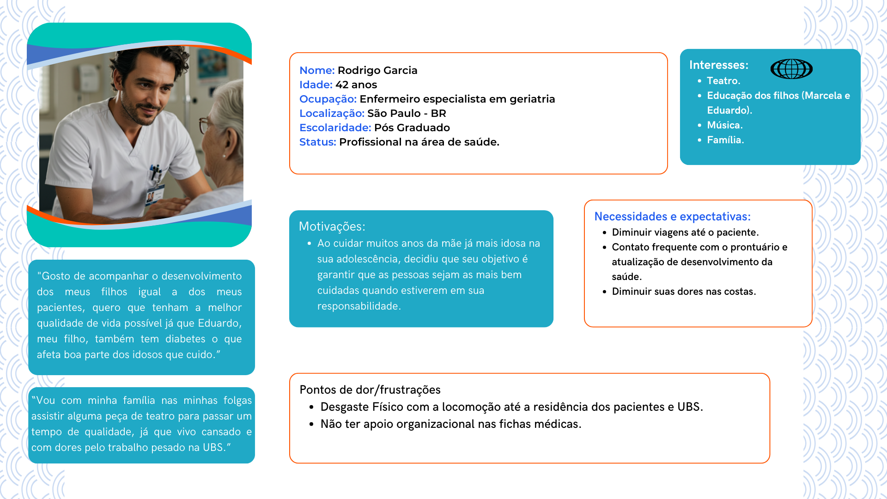

# WAD - Web Application Document - Módulo 2 - Inteli

**_Os trechos em itálico servem apenas como guia para o preenchimento da seção. Por esse motivo, não devem fazer parte da documentação final_**

## Nome do Grupo

#### Nomes dos integrantes do grupo

## Sumário

[1. Introdução](#c1)

[2. Visão Geral da Aplicação Web](#c2)

[3. Projeto Técnico da Aplicação Web](#c3)

[4. Desenvolvimento da Aplicação Web](#c4)

[5. Testes da Aplicação Web](#c5)

[6. Estudo de Mercado e Plano de Marketing](#c6)

[7. Conclusões e trabalhos futuros](#c7)

[8. Referências](c#8)

[Anexos](#c9)

 

# 1. Introdução (sprints 1 a 5)

*Preencha com até 300 palavras – sem necessidade de fonte*

*Contextualize aqui a problemática trazida pelo parceiro de projeto.*

*Descreva brevemente a solução desenvolvida para o parceiro de negócios. Descreva os aspectos essenciais para a criação de valor do produto, com o objetivo de ajudar a entender melhor a realidade do cliente e entregar uma solução que está alinhado com o que ele espera.*

*Observe a seção 2 e verifique que ali é possível trazer mais detalhes, portanto seja objetivo aqui. Atualize esta descrição até a entrega final, conforme desenvolvimento.*

# 2. Visão Geral da Aplicação Web (sprint 1)

## 2.1. Escopo do Projeto (sprints 1 e 4)

### 2.1.1. Modelo de 5 Forças de Porter (sprint 1)

5. O poder de negociação dos fornecedores para a realização de cirurgias plásticas voltadas à curadoria de ferimentos no Hospital de Medicina da USP é altamente relevante. Isso ocorre devido à alta especialização e à diversidade de materiais requisitados para a realização dessas cirurgias, como peles artificiais, biomateriais, equipamentos de precisão, maquinários, entre outros (REVISTA SAÚDE, 2024). Além disso, esses produtos possuem poucos fabricantes, resultando em altos custos de aquisição e manutenção. Embora o prestígio acadêmico do hospital ofereça certa visibilidade aos fornecedores e possa minimizar parcialmente esse desequilíbrio, a baixa disponibilidade de substitutos e a impossibilidade de produção própria reforçam a posição de força dos fornecedores nesse contexto (ABRAIDI, 2025). Soma-se a isso o fato de que a troca de fornecedores exige readequação de protocolos e treinamentos médicos, o que pode acarretar custos consideráveis.

### 2.1.2. Análise SWOT da Instituição Parceira (sprint 1)

*Preencha com até 100 palavras – sem necessidade de fonte*

*Apresente uma visão geral da situação do parceiro com base na matriz SWOT (forças, fraquezas, oportunidades e ameaças). Foque na relação com os concorrentes e o posicionamento da instituição.*

### 2.1.3. Solução (sprints 1 a 5)

#### 1. Problema a ser resolvido

Uma parcela significativa da população brasileira convive com feridas crônicas, como úlceras por pressão, úlceras venosas e lesões associadas ao diabetes. Estima-se que mais de 2 milhões de brasileiros sofram com esse tipo de condição, sendo a maioria composta por idosos ou pessoas com comorbidades, o que contribui para dificuldades de locomoção e acesso recorrente aos serviços de saúde (ITL, 2025; HOSPITAL ALEMÃO OSWALDO CRUZ, 2023). Essa limitação faz com que muitos pacientes só procurem ajuda médica em estágios avançados da lesão, resultando em aumento da dor, risco de infecção, amputações, maior mortalidade e custos elevados de tratamento para o Sistema Único de Saúde (SUS) (SILVA et al., 2023; MOHR et al., 2023).

#### 2. Dados disponíveis

As feridas crônicas representam um desafio significativo para a saúde pública, afetando milhões de pessoas em todo o mundo. Estudos indicam que cerca de 20 milhões de indivíduos convivem com feridas crônicas globalmente, evidenciando a magnitude do problema (HOSPITAL ALEMÃO OSWALDO CRUZ, 2023).

No Brasil, a prevalência dessas lesões é particularmente preocupante entre a população idosa. Um estudo realizado com 339 idosos assistidos na atenção básica revelou prevalências de 5,0% para lesão por pressão, 3,2% para úlcera diabética e 2,9% para úlcera vasculogênica. Fatores como inatividade física e ausência de atividade laboral aumentaram significativamente o risco de desenvolvimento dessas feridas (SILVA et al., 2018).

Além das implicações físicas, as feridas crônicas impactam negativamente a qualidade de vida dos pacientes, afetando aspectos como mobilidade, sono e bem-estar emocional. A dor associada às lesões é frequentemente destacada como um dos principais fatores que comprometem a percepção de saúde e a capacidade funcional dos indivíduos (SANTOS et al., 2017).

Diante desse cenário, torna-se evidente a necessidade de estratégias eficazes para prevenção, monitoramento e tratamento das feridas crônicas, visando melhorar a qualidade de vida dos pacientes e reduzir os custos associados ao sistema de saúde.

#### 3. Solução proposta

Será desenvolvido um sistema web de telemonitoramento voltado para pacientes portadores de feridas crônicas, com o objetivo de melhorar o acompanhamento contínuo, promover o autocuidado e facilitar a atuação dos profissionais de saúde, especialmente no contexto da Atenção Primária.

O sistema contará com duas interfaces distintas, sendo uma voltada aos pacientes e outra aos profissionais de saúde das Unidades Básicas de Saúde (UBS) e agentes comunitários. A interface será desenvolvida segundo às necessidades e limitações dos seus usuários, especialmente considerando que muitos pacientes são idosos e podem ter pouca familiaridade com tecnologia.

#### Funcionalidades da interface do paciente:

- Envio periódico de fotos padronizadas da ferida, com uso de régua de medição integrada à imagem para facilitar o acompanhamento da evolução;
- Preenchimento de questionários de saúde simples e acessíveis, sobre dor, secreção, sinais de infecção, entre outros indicadores clínicos;
- Acesso a vídeos educativos personalizados conforme o tipo de ferida (úlceras por pressão, úlceras venosas ou pé diabético)
- Alertas e lembretes automáticos para envio de informações ou visualização de conteúdos importantes.
- Acesso a ficha médica preenchida pelo profissional de saúde, para que o paciente também possa acompanhar a sua evolução.

#### Funcionalidades da interface do profissional:

- Recebimento em tempo real das informações enviadas pelos pacientes sob sua responsabilidade;
- Painel com histórico evolutivo das feridas, com fotos comparativas e respostas dos questionários;
- Registro de condutas clínicas, envio de orientações personalizadas e acompanhamento remoto dos casos.

#### 4. Forma de utilização da solução

O sistema web de telemonitoramento será utilizado para conectar pacientes portadores de feridas crônicas às equipes das Unidades Básicas de Saúde (UBS). Inicialmente, agentes de saúde localizarão os pacientes nas comunidades e realizarão o cadastro no sistema. Os pacientes preencherão questionários sobre sua saúde geral e enviarão imagens da ferida utilizando uma régua como referência de tamanho. A comunicação ocorrerá de maneira periódica, com o envio de novas informações e fotos, conforme cronograma definido pelo profissional de saúde. Caso o paciente não envie atualizações dentro do prazo, a UBS será notificada para fazer o contato ativo. Além disso, o sistema oferecerá vídeos educativos adaptados ao tipo de ferida de cada paciente, promovendo maior conhecimento e adesão ao tratamento. Para pacientes com baixa alfabetização, haverá recursos de áudio para facilitar a comunicação.

#### 5. Benefícios esperados

A implementação do sistema web trará benefícios significativos tanto para os pacientes quanto para o Sistema Único de Saúde (SUS). Para os pacientes, o sistema facilitará o acompanhamento contínuo da condição, permitirá a detecção precoce de agravamentos e aumentará a adesão ao tratamento, promovendo melhora na qualidade de vida. Para os profissionais de saúde, o sistema otimizará o monitoramento dos casos, permitindo intervenções mais rápidas e baseadas em informações atualizadas. No âmbito do SUS, espera-se reduzir a necessidade de hospitalizações prolongadas e os custos associados ao tratamento de feridas crônicas. O projeto também busca promover a educação em saúde, autonomia aos pacientes no autocuidado e na gestão de sua condição.

Como referência de sucesso, destaca-se o projeto de telemonitoramento desenvolvido pela Universidade do Oeste Paulista (UNOESTE), que já realizou mais de 7 mil atendimentos à distância, demonstrando eficácia no cuidado remoto e redução na sobrecarga dos serviços presenciais. A iniciativa mostra que tecnologias de acompanhamento à distância, quando bem implementadas, podem ser escaladas e adaptadas a diferentes contextos de atenção à saúde (UNOESTE, 2023).

#### 6. Critério de sucesso e como será avaliado

- Critério principal: Taxa de adesão dos pacientes ao sistema (número de atualizações enviadas dentro do prazo combinado).
- Critérios complementares:
    - Redução do tamanho ou melhora clínica das feridas ao longo do acompanhamento.
    - Satisfação dos profissionais de saúde em relação ao uso do sistema, avaliada via questionários.
    - Feedback dos pacientes sobre a usabilidade e benefícios percebidos do sistema.
- Forma de avaliação:
    - Análise de métricas extraídas do sistema (frequência de envio de dados, tempo de resposta).
    - Avaliação qualitativa com entrevistas e questionários aplicados aos profissionais e pacientes participantes do projeto-piloto nas UBS.

### 2.1.4. Value Proposition Canvas (sprint 1): 
# Canvas Proposta de Valor

De acordo com o estudo “Business Model Canvas: aplicação do método em uma empresa” (SANTOS et al., 2020), CANVAS é uma ferramenta de negócios que auxilia as empresas ou empreendedores a encontrar a melhor forma de identificar a proposta de valor de uma empresa, aplicando a partir de segmentos como abordado no modelo a seguir.  
A partir desta explicação foi identificado que o público alvo é qualquer individuo que possa desenvolver feridas sejam de não emergências a emergenciais ao depender de seu caso clínico.  

   Imagem 1: CANVAS - Proposta de valor 
    
   Fonte: Til.app.ia, 2025 (Autoral)
 

---

## Segmento Cliente:

### Tarefas:

* Buscar apoio médico para tratamento médico para tratamento de ferida: Necessidade de opnião médica para resolução de problema se encaminhando para unidade pública ou particular de saúde mais próxima.
* Cuidar das feridas: Tratamento incorreto dos ferimentos pode gerar problemas sérios de saúde.
* Acompanhamento de feridas: Limpezas e cuidados com o local do ferimento solo em sua residência, sem acompanhamento adequado.

### Ganhos:

* Custo de transporte: Reduz o custo de transporte até a unidade de saúde.
* Custo de medicamentos: Com um cuidado adequado não é necessário tratar o ferimento em maior tempo que o necessário para a cicatrização/tratamento, evitando maiores gastos.
* Satisfação com o atendimento: Com um acompanhamento adequado e personalidade com o paciente, seu nível de satisfação aumenta.
* Cicatrização da ferida corretamente: Com cuidados de forma orientada e com materiais de qualidade,a minimização de danos à pele tem suas chances aumentadas.

### Dores:

* Infecção: Sem uma indicação ou acompanhamento adequado o paciente se encontra em cenário favorável a infecções e piora de quadro.
* Dor: Com o ferimento exposto, o público-alvo pode sentir de leves a fortes dores.
* Mobilidade até a unidade de saúde: O público ao se movimentar até a unidade de saúde para acompanhamento tem perca de tempo e financeira ao realizar o trajeto, gerando insatisfação.
* Desinformação: A falta de conhecimento gera a propensão de agravamento de quadro clínico, realizando portanto cuidados inadequados.
* Falta de acompanhamento: Após a primeira consulta médica, na maioria das vezes o paciente não volta para o monitoramento da lesão.

## Segmento Solução:

### Criador de Ganhos:

* Ícones Maiores: Ao identificar que parte do público é idoso é necessário design atrativo e visível para indivíduos com problemas visuais.
* Acessibilidade: Ao assegurar recursos no qual o indivíduo consiga acessar de maneira fácil e lúdica, garantimos a acessibilidade para o público.
* Ajuda Imediata: Junto ao acompanhamento do profissional de saúde é possível identificação de agravamento de quadro e encaminhamento imediato a emergência. Além disso, será disponibilizado ao usuário o botão de socorro no qual será encaminhado o número da ambulância em seu dispositivo móvel.
* Autonomia: Com os vídeos disponíveis o público tem a confiança em realizar os procedimentos com a recomendação de um médico.

### Analgésicos:

* Site de acesso mobile: Com o método mobile conseguimos expandir a utilização da aplicação web.
* Rotina de análise profissional: Com os registros obtidos e encaminhados ao um banco de dados o profissional consegue manter uma aproximação do paciente, o que leva uma alta na satisfação do atendimento e empatia no atendimento.
* Duas interfaces: Existindo uma relação interpessoal entre os profissionais e os pacientes identificamos a necessidade de duas interfaces diferentes que atendam as necessidades dessas duas figuras.

## Produtos e Serviços:

* Atendimento Personalizado: Ao gerar um cadastrado o atendimento realizado pelo profissional da saúde é individual a cada caso analisado e acompanhado.
* Sinais de alerta: Através de softwares de reconhecimento de imagem é possível verificar a partir da imagem gerada pelo dispositivo móvel do paciente colorações que apresentem risco ao quadro de saúde observado.
* Vídeos de autocuidado: Os vídeos disponibilizados pelo departamento de cirurgia plástica do hospital das clínicas em São Paulo garantem cuidados corretos e sinais de atenção, sendo disponibilizado a todo o momento para consulta do público-alvo dentro da plataforma.
* Acompanhamento remoto gradual: Será oferecido um acompanhamento dos hematomas através de imagens de maneira contínua até a resolução do quadro, no qual será acompanhado por um agente de saúde remotamente evitando desgaste físico dos pacientes.

### 2.1.5. Matriz de Riscos do Projeto (sprint 1)

| \#  | Ameaças | Impacto |
| --- | --- | --- |
| 1: | Queda de internet. | Impossibilidade de commits no código |
| 2: | Ferramentas off-line | Possíveis atrasos e não conclusão das tarefas |
| 3: | Mal planejamento das tarefas | Atraso na conclusão de tarefas e entrega nos prazos. |
| 4: | Entregas quinzenais ineficientes | Perda de confiança e perda de nota nos artefatos |
| 5: | Não conclusão do projeto | Queda na reputação com o parceiro, atraso relevante na entrega final e perda de nota do artefato. |
| 6: | Bugs no código | Atraso\impossibilidade de entrega dentro dos prazos |
| 7: | Conflito de visões para entrega do projeto | Desperdício de tempo em tarefas já designadas e discussão de ideias já definidas. |

| \#  | Oportunidades | Impacto |
| --- | --- | --- |
| 9: | Aprendizado. | O desenvolvimento e o aprendizado estão extremamente ligados pois à medida que aprendemos desenvolvemos e quando desenvolvemos aprendemos, sempre através de aulas, autoestudos, cursos, etc. |
| 10: | Engajamento. | Quando o grupo está engajado todos estão cumprindo com suas obrigações, realizando as tarefas e as entregando dentro dos prazos, isso faz com que o projeto ande e que todos possam evoluir juntos. |
| 11: | Aulas/Workshops para aprimoramento de habilidades técnicas. | Ter orientações extras sobre temas que são necessários para o desenvolvimento é uma ótima maneira para evoluir habilidades técnicas, podendo revisar conteúdos que possam ter passado e deixado dúvidas. |  
| 12: | Feedback positivo | Receber reconhecimento ou validação inesperada de profissionais ou especialistas pode impulsionar o projeto. |

## 2.2. Personas (sprint 1)

*Posicione aqui suas Personas em forma de texto markdown com imagens, ou como imagem de template preenchido. Atualize esta seção ao longo do módulo se necessário.*

# Persona 1

   Imagem 1: Persona 1 - Rodrigo Garcia 
    
   Fonte: Til.app.ia, 2025 (Autoral)
 

## Persona 1

**Nome e sobrenome:** Rodrigo Garcia  
**Idade:** 42  
**Ocupação:** Enfermeiro especialista em Geriatria  
**Localização:** São Paulo - BR  
**Escolaridade:** Pós-graduado  
**Status:** Profissional na área de saúde  

### Biografia
> "Gosto de acompanhar o desenvolvimento dos meus filhos igual a dos meus pacientes, quero que tenham a melhor qualidade de vida possível já que Eduardo, meu filho, também tem diabetes o que afeta boa parte dos idosos que cuido.”  
> “Vou com minha família nas minhas folgas assistir alguma peça de teatro para passar um tempo de qualidade, já que vivo cansado e com dores pelo trabalho pesado na UBS.”

### Interesses
- Teatro  
- Educação dos filhos (Marcela e Eduardo)  
- Música  
- Família  

### Necessidades e Expectativas
- Diminuir viagens até o paciente  
- Contato frequente com o prontuário e atualização de desenvolvimento da saúde  
- Diminuir suas dores nas costas  

### Motivações
- Ao cuidar muitos anos da mãe já mais idosa na sua adolescência, decidiu que seu objetivo é garantir que as pessoas sejam as mais bem cuidadas quando estiverem em sua responsabilidade.

### Pontos de Dor
- Desgaste físico com a locomoção até a residência dos pacientes e UBS  
- Não ter apoio organizacional nas fichas médicas

## 2.3. User Stories (sprints 1 a 5)

*Posicione aqui a lista de User Stories levantadas para o projeto. Siga o template de User Stories e utilize a mesma referência USXX no roadmap de seu quadro Kanban. Indique todas as User Stories mapeadas, mesmo aquelas que não forem implementadas ao longo do projeto. Não se esqueça de explicar o INVEST das 5 User Stories prioritárias*

*ATUALIZE ESTA SEÇÃO SEMPRE QUE ALGUMA DEMANDA MUDAR EM SEU PROJETO*

*Template de User Story*
Identificação | USXX (troque XX por numeração ordenada das User Stories)
--- | ---
Persona | nome da Persona
User Story | "como (papel/perfil), posso (ação/meta), para (benefício/razão)"
Critério de aceite 1 | CR1: descrever cenário + testes de aceite
Critério de aceite 2 | CR2: descrever cenário + testes de aceite
Critério de aceite ... | CR...
Critérios INVEST | *(Por que é Independente? Por que é Negociável? Por que é Valorosa? Por que é Estimável? Por que é Pequena? Por que é Testável?)*

# 3. Projeto da Aplicação Web (sprints 1 a 4)

## 3.1. Arquitetura (sprints 3 e 4)

*Posicione aqui o diagrama de arquitetura da sua solução de aplicação web. Atualize sempre que necessário*

## 3.2. Wireframes (sprint 2)

*Posicione aqui as imagens do wireframe construído para sua solução e, opcionalmente, o link para acesso (mantenha o link sempre público para visualização)*

## 3.3. Guia de estilos (sprint 3)

*Descreva aqui orientações gerais para o leitor sobre como utilizar os componentes do guia de estilos de sua solução*

### 3.3.1 Cores

*Apresente aqui a paleta de cores, com seus códigos de aplicação e suas respectivas funções*

### 3.3.2 Tipografia

*Apresente aqui a tipografia da solução, com famílias de fontes e suas respectivas funções*

### 3.3.3 Iconografia e imagens 

*(esta subseção é opcional, caso não existam ícones e imagens, apague esta subseção)*

*posicione aqui imagens e textos contendo exemplos padronizados de ícones e imagens, com seus respectivos atributos de aplicação, utilizadas na solução*

## 3.4 Protótipo de alta fidelidade (sprint 3)

*posicione aqui algumas imagens demonstrativas de seu protótipo de alta fidelidade e o link para acesso ao protótipo completo (mantenha o link sempre público para visualização)*

## 3.5. Modelagem do banco de dados (sprints 2 e 4)

### 3.5.1. Modelo relacional (sprints 2 e 4)

*posicione aqui os diagramas de modelos relacionais do seu banco de dados, apresentando todos os esquemas de tabelas e suas relações. Utilize texto para complementar suas explicações, se necessário* 

### 3.5.2. Consultas SQL e lógica proposicional (sprint 2)

*posicione aqui uma lista de consultas SQL compostas, realizadas pelo back-end da aplicação web, com sua respectiva lógica proposicional, descrita conforme template abaixo. Lembre-se que para usar LaTeX em markdown, basta você colocar as expressões entre $ ou $$*

*Template de SQL + lógica proposicional*
#1 | ---
--- | ---
**Expressão SQL** | SELECT * FROM suppliers WHERE (state = 'California' AND supplier_id <> 900) OR (supplier_id = 100); 
**Proposições lógicas** | $A$: O estado é 'California' (state = 'California')   $B$: O ID do fornecedor não é 900 (supplier_id ≠ 900)   $C$: O ID do fornecedor é 100 (supplier_id = 100)
**Expressão lógica proposicional** | $(A \land B) \lor C$
**Tabela Verdade** | <table> <thead> <tr> <th>$A$</th> <th>$B$</th> <th>$C$</th> <th>$(A \land B)$</th> <th>$(A \land B) \lor C$</th> </tr> </thead> <tbody> <tr> <td>F</td> <td>F</td> <td>F</td> <td>F</td> <td>F</td> </tr> <tr> <td>F</td> <td>F</td> <td>V</td> <td>F</td> <td>V</td> </tr> <tr> <td>F</td> <td>V</td> <td>F</td> <td>F</td> <td>F</td> </tr> <tr> <td>F</td> <td>V</td> <td>V</td> <td>F</td> <td>V</td> </tr> <tr> <td>V</td> <td>F</td> <td>F</td> <td>F</td> <td>F</td> </tr> <tr> <td>V</td> <td>F</td> <td>V</td> <td>F</td> <td>V</td> </tr> <tr> <td>V</td> <td>V</td> <td>F</td> <td>V</td> <td>V</td> </tr> <tr> <td>V</td> <td>V</td> <td>V</td> <td>V</td> <td>V</td> </tr> </tbody> </table>

*Dica: edite a tabela verdade fora do markdown, para ter melhor controle*

## 3.6. WebAPI e endpoints (sprints 3 e 4)

*Utilize um link para outra página de documentação contendo a descrição completa de cada endpoint. Ou descreva aqui cada endpoint criado para seu sistema.* 

*Cada endpoint deve conter endereço, método (GET, POST, PUT, PATCH, DELETE), header, body e formatos de response*

# 4. Desenvolvimento da Aplicação Web

## 4.1. Primeira versão da aplicação web (sprint 3)

*Descreva e ilustre aqui o desenvolvimento da sua primeira versão do sistema web, explicando brevemente o que foi entregue em termos de código e sistema. Utilize prints de tela para ilustrar. Indique as eventuais dificuldades e próximos passos.*

## 4.2. Segunda versão da aplicação web (sprint 4)

*Descreva e ilustre aqui o desenvolvimento da sua segunda versão do sistema web, explicando brevemente o que foi entregue em termos de código e sistema. Utilize prints de tela para ilustrar. Indique as eventuais dificuldades e próximos passos.*

## 4.3. Versão final da aplicação web (sprint 5)

*Descreva e ilustre aqui o desenvolvimento da última versão do sistema web, explicando brevemente o que foi entregue em termos de código e sistema. Utilize prints de tela para ilustrar. Indique as eventuais dificuldades e próximos passos.*

# 5. Testes

## 5.1. Relatório de testes de integração de endpoints automatizados (sprint 4)

*Liste e descreva os testes unitários dos endpoints criados, automatizados e planejados para sua solução. Posicione aqui também o relatório de cobertura de testes Jest se houver (através de link ou transcrito para estrutura markdown)*

## 5.2. Testes de usabilidade (sprint 5)

*Posicione aqui as tabelas com enunciados de tarefas, etapas e resultados de testes de usabilidade. Ou utilize um link para seu relatório de testes (mantenha o link sempre público para visualização)*

# 6. Estudo de Mercado e Plano de Marketing (sprint 4)

## 6.1 Resumo Executivo

*Preencher com até 300 palavras, sem necessidade de fonte*

*Apresente de forma clara e objetiva os principais destaques do projeto: oportunidades de mercado, diferenciais competitivos da aplicação web e os objetivos estratégicos pretendidos.*

## 6.2 Análise de Mercado

*a) Visão Geral do Setor (até 250 palavras)*
*Contextualize o setor no qual a aplicação está inserida, considerando aspectos econômicos, tecnológicos e regulatórios. Utilize fontes confiáveis.*

*b) Tamanho e Crescimento do Mercado (até 250 palavras)*
*Apresente dados quantitativos sobre o tamanho atual e projeções de crescimento do mercado. Utilize fontes confiáveis.*

*c) Tendências de Mercado (até 300 palavras)*
*Identifique e analise tendências relevantes (tecnológicas, comportamentais e mercadológicas) que influenciam o setor. Utilize fontes confiáveis.*

## 6.3 Análise da Concorrência

*a) Principais Concorrentes (até 250 palavras)*
*Liste os concorrentes diretos e indiretos, destacando suas principais características e posicionamento no mercado.*

*b) Vantagens Competitivas da Aplicação Web (até 250 palavras)*
*Descreva os diferenciais da sua aplicação em relação aos concorrentes, sem necessidade de citação de fontes.*

## 6.4 Público-Alvo

*a) Segmentação de Mercado (até 250 palavras)*
Descreva os principais segmentos de mercado a serem atendidos pela aplicação. Utilize bases de dados e fontes confiáveis.*

*b) Perfil do Público-Alvo (até 250 palavras)*
*Caracterize o público-alvo com dados demográficos, psicográficos e comportamentais, incluindo necessidades específicas. Utilize fontes obrigatórias.*

## 6.5 Posicionamento

*a) Proposta de Valor Única (até 250 palavras)*
*Defina de maneira clara o que torna a sua aplicação única e valiosa para o mercado.*

*b) Estratégia de Diferenciação (até 250 palavras)*
*Explique como sua aplicação se destacará da concorrência, evidenciando a lógica por trás do posicionamento.*

## 6.6 Estratégia de Marketing 

*a) Produto/Serviço (até 200 palavras)*
*Descreva as funcionalidades, benefícios e diferenciais da aplicação*

*6.2 Preço (até 200 palavras)*
*Explique o modelo de precificação adotado e justifique com base nas análises anteriores.*

*6.3 Praça (Distribuição) (até 200 palavras)*
*Apresente os canais digitais utilizados para distribuir e entregar a aplicação ao público.*

*6.4 Promoção (até 200 palavras)*
*Descreva as estratégias digitais planejadas, como SEO, redes sociais, marketing de conteúdo e campanhas pagas.*

# 7. Conclusões e trabalhos futuros (sprint 5)

*Escreva de que formas a solução da aplicação web atingiu os objetivos descritos na seção 2 deste documento. Indique pontos fortes e pontos a melhorar de maneira geral.*

*Relacione os pontos de melhorias evidenciados nos testes com planos de ações para serem implementadas. O grupo não precisa implementá-las, pode deixar registrado aqui o plano para ações futuras*

*Relacione também quaisquer outras ideias que o grupo tenha para melhorias futuras*

# 8. Referências (sprints 1 a 5)

REVISTA SAÚDE USP. Inovação e dependência tecnológica no tratamento de queimaduras graves. Revista de Saúde da Universidade de São Paulo, São Paulo, v. 29, n. 3, p. 45-60, 2024.

ABRAIDI – Associação Brasileira de Importadores e Distribuidores de Produtos para Saúde. Relatório Setorial ABRAIDI 2024. São Paulo: ABRAIDI, 2024. Disponível em: https://www.abraidi.com.br/. Acesso em: 28 abr. 2025.

UNOESTE. *Telemonitoramento já prestou mais de 7 mil atendimentos*. 2023. Disponível em: https://www.unoeste.br/noticias/2023/4/telemonitoramento-ja-prestou-mais-de-7-mil-atendimentos. Acesso em: 2 maio 2025.

HOSPITAL ALEMÃO OSWALDO CRUZ. *Estudos apontam que cerca de 20 milhões de pessoas têm feridas crônicas no mundo*. 2023. Disponível em: https://www.hospitaloswaldocruz.org.br/imprensa/releases/estudos-apontam-que-cerca-de-20-milhoes-de-pessoas-tem-feridas-cronicas-no-mundo/. Acesso em: 2 maio 2025.

SILVA, K. M. et al. Prevalência e fatores associados a feridas crônicas em idosos na atenção básica. *Revista da Escola de Enfermagem da USP*, São Paulo, v. 52, e03415, 2018. Disponível em: https://www.scielo.br/j/reeusp/a/vhRVSFBnrGndry36ZV5GFvz/?lang=pt. Acesso em: 2 maio 2025.

SANTOS, V. L. C. G. et al. Qualidade de vida relacionada a aspectos clínicos em pessoas com feridas crônicas. *Revista da Escola de Enfermagem da USP*, São Paulo, v. 51, e03217, 2017. Disponível em: https://www.scielo.br/j/reeusp/a/kFCt5yL6FYxqBcvHCyw3cwG/?lang=pt. Acesso em: 2 maio 2025.

ITL – Instituto de Tratamento de Feridas. *Feridas crônicas: entenda o que são e como tratar*. 2025. Disponível em: https://itl.med.br/2025/02/feridas-cronicas/. Acesso em: 2 maio 2025.

MOHR, Helena Sophia Strauss et al. *Cuidado de enfermagem à pessoa com ferida na Atenção Primária à Saúde: desafios e potências*. Rev. Estima, São Paulo, v. 21, e1437, 2023.

# Anexos

*Inclua aqui quaisquer complementos para seu projeto, como diagramas, imagens, tabelas etc. Organize em sub-tópicos utilizando headings menores (use ## ou ### para isso)*
